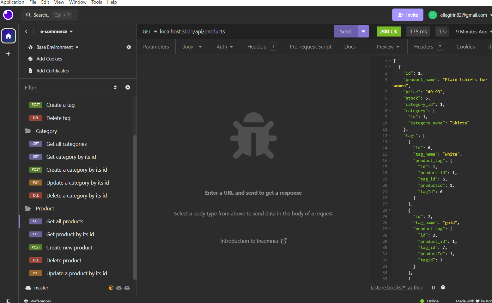
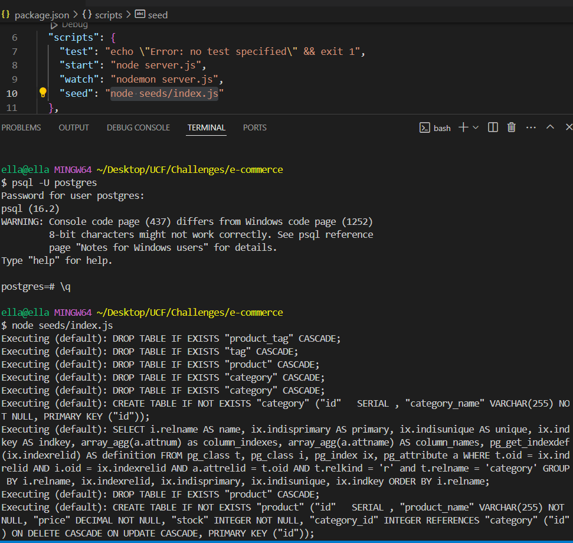
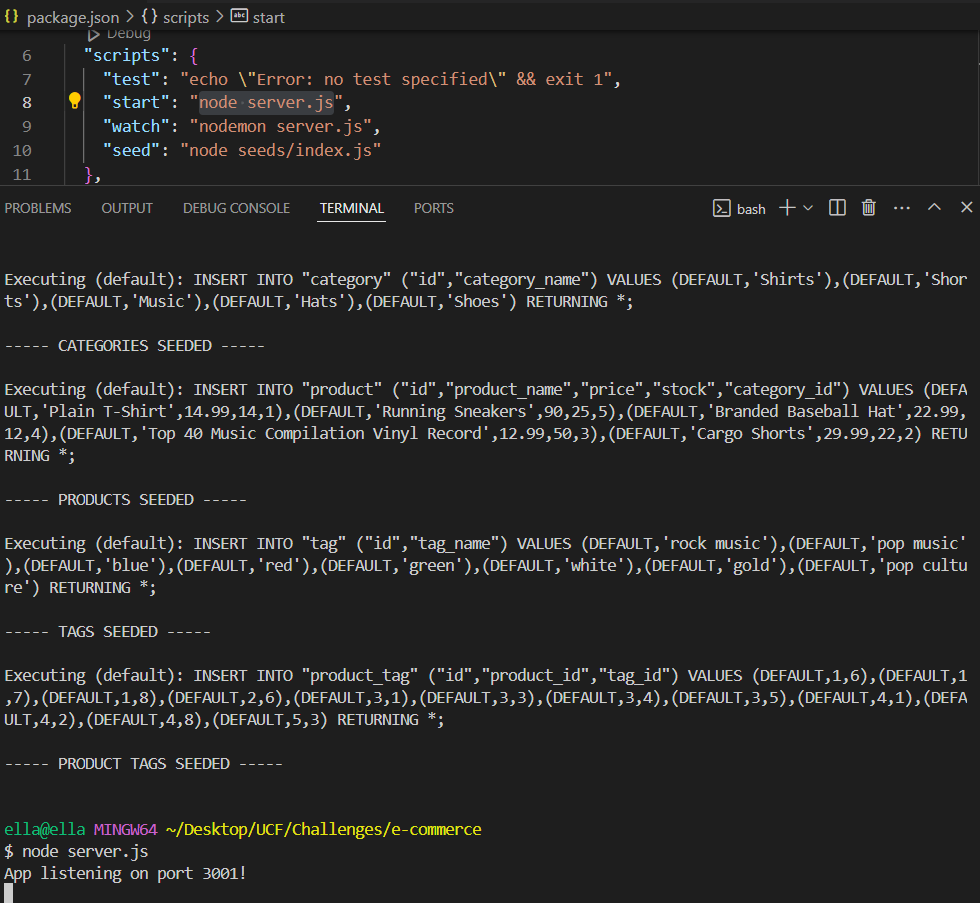

# E-commerce Application
This e-commerce site backend is built with Node.js, Express.js, Sequelize ORM, and PostgreSQL. It provides a RESTful API to manage products, categories, and tags, enabling robust and scalable data management for an online retail platform.  

 
  

# Running the application 
   
   

# Video Demonstration
https://drive.google.com/file/d/11SDXJuF4B5fVV6NhrMXDFAfGyIoG6jaw/view?usp=sharing
  

# Technologies Used
Express.js API 
Sequelize 
PostgreSQL 
Node.js 
JavaScript 
ORM (Object-Relational Mapping) 
RESTful API 
Git 
GitHub 
Insomnia